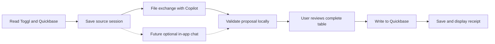

Timekeeper: reference review and proposed application
===================================================

Reviewed September 28, 2026. This is the initial code, package, and feasibility review; no application or installer has been built in this pass. No live Toggl or Quickbase requests were made.

The requested workflow is feasible. The existing engine provides useful API mappings, assignment lookup, daily and date-range reads, and write-result handling. The largest required change is a local validation and submission layer: the current scripts rely on Copilot to enforce rules that affect billing.

Confirmed preferences: Windows only. Each user can configure the automatic Timecards entry and weekday fill; initial defaults are 0.17 hours and an 8-hour weekday target. Automatic time depends on total hours, never a clock-time threshold. Add the configured Timecards amount even when worked hours reach or exceed the target; add Misc internal only for a positive remaining gap. Never reduce worked hours to meet the target. See [the confirmed time policy](TIME_POLICY.md) for calculations and examples.

The user has agent creation inside Microsoft 365 Copilot, without Copilot Studio access. The first release therefore uses Agent Builder file exchange. In-app chat is a future optional integration and is not a prerequisite for installation, setup, or daily use.

**What the reference folder contains**

| Material | Purpose and assessment |
| --- | --- |
| `_engine/tc.py` | Toggl and Quickbase integration. Contains personal identity settings, organization-specific table/field IDs, and the Tampa internal-project lookup. Useful starting point, but needs separation from command-line behavior. |
| `_engine/preview.py` | Resolves IDs to names and prints a submission preview. Its warnings do not stop submission. |
| Four `.bat` files | Read today, read a date range, find an assignment, and preview/write. Replace these actions with application screens. |
| Copilot agent instructions and setup documents | Define matching, clarification, descriptions, rounding, grouping, and automatic time. Their old clock-time and target-cap rules are superseded by `docs/TIME_POLICY.md`. Update the app's agent instructions to match that policy and the new file contract. |
| Sample read/proposed/write JSON | Demonstrates a successful existing exchange. Personal working data, unsuitable for packaging as examples. |
| `dist/__Timecards.zip` | A cleaner distribution than the working folder: placeholder identity, a setup guard, generic Copilot directions, and no sample outputs. Still uses the same weak write validation. |
| `assign_check*.py`, caches, `aliases.json` | Diagnostic/auxiliary material. The production engine does not consume the alias file. Keep these out of the installer. |

The ZIP contains the four launchers, setup guide, and two engine files. Its setup guide and preview script match the working copies. The working engine has a personal identity; the ZIP engine checks its identity placeholders before running. Preserve that distinction when extracting reusable code.

The provided example has three Toggl entries, four proposed rows, and four created records in its write receipt. Its task/category and assignment/project relationships are internally consistent. A successful sample does not demonstrate rejection of bad input or safe retry behavior.

Eight isolated offline checks exercised extracted engine/preview functions with synthetic inputs, mocked HTTP responses, blocked sockets, and in-memory file substitutes. They confirmed: invalid dates/negative hours/unverified IDs reach the writer; replay sends identical create requests; an unrecognized object envelope becomes an empty batch; an HTTP 200 response containing an empty object reports success without created IDs; a timeout escapes without a saved result; and a category-mismatch preview returns success. The partial-failure path correctly retains created IDs and reports failure. These checks did not import the diagnostic scripts, modify the reference files, or test live service behavior.

**Changes required before the app can say “Data verified”**

| Priority | Evidence in the working source | Required behavior |
| --- | --- | --- |
| High | `tc.py:430` checks required fields and converts values before posting. It does not verify dates, positive finite hours, task/category pairs, assignment/project pairs, or the source read. | Validate imported data against the saved source session and trusted Quickbase reference data. Reject malformed, inconsistent, or unrelated proposals. |
| High | `tc.py:452` posts new rows without a replay guard or a check for intervening Quickbase changes. | Recheck existing records before submission, prevent duplicate clicks, and persist a submission journal. Retrying a completed proposal must not create another set of records. |
| High | Network exceptions at `tc.py:452` can bypass result persistence. `tc.py:464` treats missing error metadata as success. | Distinguish confirmed success, confirmed row failure, and unknown outcome. Reconcile unknown outcomes before allowing retries; require expected record counts and a valid response. |
| High | `preview.py:94` collects relational warnings but returns success at line 123. It also omits date, task, and category from its displayed columns. | Block invalid data and show every billing field, per-day totals, existing time, and new time. |
| Medium | `tc.py:35` embeds identity, realm, office matching, and schema settings. | Use a setup wizard and an organization profile. Verify the displayed Quickbase identity; keep credentials separate from ordinary settings. |
| Medium | `tc.py:205` requests date-only bounds and groups entries in the computer's timezone. Agent instructions specify America/New_York. | Use an explicit configured timezone for request boundaries, day grouping, and “today.” Test daylight-saving changes and timers spanning midnight. The server interpretation of date-only bounds was not live-tested. |
| Medium | `tc.py:227` omits Toggl entry IDs, exact duration seconds, stop timestamps, and billable flags. Existing records at `tc.py:196` expose project/task/category names without their corresponding IDs. | Retain source IDs and exact durations for reconciliation and rounding. Read existing relationship IDs as well as names. Timestamps support date attribution and running-timer checks; automatic time must not depend on a clock-time cutoff. |
| Medium | `tc.py:129`, `132`, and `196` use fixed-size queries; assignment queries have a separate cap. | Paginate reference and existing-record reads; treat incomplete data as a visible condition that can block verification. |

Exact durations matter: 600 seconds becomes 0.1667 hours in the current export. Applying a literal “round up to the next five minutes” to that rounded number can produce 15 minutes instead of 10. Calculate rounding from integer seconds, aggregate before final decimal formatting, and validate totals locally.

“Data verified” should mean the app checked the file, identity, dates, references, calculations, source coverage, and duplicate state. A user must still review whether the selected assignment and description represent the work performed. Copilot choosing valid IDs does not prove that it chose the correct client matter.

**Proposed user experience**

1. **First launch:** enter Toggl and Quickbase tokens, email, and Quickbase employee ID; test connections; confirm identity and internal project; review per-user time defaults. Provide an Open Copilot button and setup instructions for a shared or personal agent. Tokens stay in the app's credential store.
2. **Read today's data:** show the selected date, recorded hours, existing Quickbase hours, and any running timer. Offer another date or range as a secondary action. A failed read must not leave an old file presented as a new result.
3. **Send to Copilot:** display a large central file card representing a real local export. Dragging it provides a native file transfer. Also offer Save file and Open folder.
4. **Answer Copilot's questions:** matching and description clarification remain conversational. The export carries the user's settings so Copilot follows the same defaults as the application.
5. **Bring back the proposal:** accept a downloaded JSON file by drag-and-drop or Open file, with Paste as a fallback. Give row-specific errors when the content cannot be accepted.
6. **Review:** after local validation, show a green checkmark and the complete proposed table: date, hours, project, assignment, task, category, description. Separate existing, new, and combined daily totals. Identify automatically added time.
7. **Write to Quickbase:** the user's click authorizes the displayed rows. Recheck current records and reference relationships; if material changes invalidate the preview, require review of the new result. Disable submission while a request is in progress.
8. **Receipt:** show confirmed record IDs and any failed rows. Never offer to resend successful rows. If the outcome is unknown, reconcile it before resubmission.

The app should calculate rounding, grouping totals, and automatic time. Copilot supplies proposed mappings, descriptions, and answers to ambiguities. This keeps arithmetic and validation consistent between the two chat modes.

**Implementation approach**

Reuse the Python API mappings as a service layer, replacing global identity/token configuration, console printing, and `sys.exit` with explicit settings, returned data, and structured errors. A PySide6 desktop interface is a reasonable first choice: Qt supports native Windows drag-and-drop. Bundle the interpreter and dependencies and wrap the result in a Windows installer; users will not need to install Python or use a console. These are supported capabilities, not a tested build of this project. [Qt drag-and-drop](https://doc.qt.io/qtforpython-6/overviews/qtgui-dnd.html), [PyInstaller packaging](https://pyinstaller.org/en/stable/operating-mode.html).

Use background workers for API calls, an OS-protected credential store for tokens, ordinary per-user settings for non-secret preferences, and a local database for source sessions and submission receipts. Store mutable files in the user's application-data directory. The installer should include only application assets and clean setup material. [Microsoft credential storage guidance](https://learn.microsoft.com/en-us/windows/apps/develop/security/credential-locker).

Introduce a versioned exchange format. The read export should carry a session ID, generation time, configured timezone, identity, requested dates, effective policy, exact source entries, existing records, and reference IDs. The returned proposal should echo the session ID and associate rows with source entry IDs; automatic entries should have explicit types. Compare these values against the app's saved session, not against imported metadata alone. A legacy JSON array can be inspected, but it should not earn full verification without being reconciled to a source session.

Keep API credentials out of both files. Minimize assignment and client context to what matching needs. Imported files are data only; no imported executable code, macros, or model-provided commands should run.

A local journal and fresh duplicate checks reduce replay risks on one installation. Strong protection against simultaneous submissions from different devices requires a suitable unique submission/source key in Quickbase, or an equivalent server-side mechanism. Do not promise exactly-once creation from a local journal alone. No Quickbase schema change is proposed for execution during this review.

**Copilot file exchange and optional in-app chat**

Work/school Microsoft Copilot lists JSON as supported input. Agent code interpreter can generate downloadable files, available during the active session. Microsoft's documentation describes saving those downloads; it does not establish that dragging a generated link directly into an arbitrary desktop app transfers a real file. Plan to test the actual browser/Copilot host and retain Download then drop, Open file, and Paste. If the selected agent host rejects JSON, a text export containing the same structured content is a possible compatibility fallback. [Supported formats](https://support.microsoft.com/en-us/microsoft-365-copilot/file-formats-supported-by-microsoft-365-copilot), [Agent file generation](https://learn.microsoft.com/en-us/microsoft-365/copilot/extensibility/code-interpreter).

The supplied setup creates an Agent Builder agent inside Microsoft 365. That setup alone does not provide an endpoint for embedding the same agent in Timekeeper.

If Copilot Studio access becomes available later, the recommended optional integration is a Studio agent accessed through the Microsoft 365 Agents SDK's Copilot Studio client. Microsoft documents Python, .NET, and JavaScript clients for custom web/native apps and delegated user sign-in. IT would configure the agent, Entra application registration, delegated invocation permission, and tenant/client/environment/agent identifiers. The app could send context and receive proposal JSON within its chat UI, feeding the same validator as file import. Structured proposal handling is application/agent work that still needs a prototype. This integration is deferred for the first release. [Microsoft native-app integration](https://learn.microsoft.com/en-us/microsoft-copilot-studio/publication-integrate-web-or-native-app-m365-agents-sdk).

Use Microsoft's normal browser or Windows authentication broker for sign-in, then keep the conversation inside Timekeeper. A distributed native app must not contain a confidential client secret. This design does not depend on embedding the Microsoft 365 website. [Microsoft sign-in guidance](https://learn.microsoft.com/en-us/entra/msal/dotnet/acquiring-tokens/using-web-browsers), [Native client sample](https://github.com/microsoft/Agents/tree/main/samples/dotnet/copilotstudio-client).

The separate Graph Copilot Chat API remains a preview endpoint whose documentation excludes production use. It requires broad delegated permissions, has no documented selector for the supplied Agent Builder agent, and offers text responses without code interpreter/file generation. It is not the recommended production path for this application. [API contract and permissions](https://learn.microsoft.com/en-us/microsoft-365/copilot/extensibility/api/ai-services/chat/copilotconversation-chat), [Capabilities and licensing](https://learn.microsoft.com/en-us/microsoft-365/copilot/extensibility/api/ai-services/chat/overview).

Copilot Studio access, native-channel usage costs, and tenant policies need confirmation before enabling embedded chat. Do not assume a Microsoft 365 Copilot subscription covers custom-app usage. File exchange remains usable without the optional application's Microsoft sign-in setup. [Copilot Studio licensing](https://learn.microsoft.com/en-us/microsoft-copilot-studio/billing-licensing).

**Remaining decisions and acceptance checks**

The confirmed configurable defaults should be saved per user and copied into every source session. The user explicitly removed the old 5:30 PM exception and the restriction preventing Timecards from taking the total above the target. Seven hours of work plus 0.17 Timecards plus 0.83 Misc internal totals 8.00; nine hours of work plus 0.17 Timecards totals 9.17, with no Misc internal. These are required acceptance cases. Also document behavior for zero-entry weekdays, leave/holidays, work spanning midnight, and office-specific internal projects.

Agent Builder access is confirmed. Copilot Studio tenant configuration is a future integration decision and does not block the first release. Setup should guide users to a shared or personal Agent Builder agent and file exchange.

Before release, test invalid task/category and assignment/project pairs, stale/wrong-user proposals, omitted or repeated source entries, exact five-minute boundaries, weekend/default settings, midnight/DST boundaries, missing references, and running timers. Test below-target, near-target, at-target, and above-target totals, including the user's 7-hour and 9-hour examples, mixed billable/internal work, existing Timecards entries, and identical durations at different times of day. Simulate partial success, a timeout after server acceptance, repeated clicks, restarting the app during submission, and retrying a completed file. Then test installation and drag-and-drop on a clean Windows machine without Python. A live write acceptance test belongs in a designated test table or explicitly agreed test case.

Suggested delivery order: extract and validate the engine; build setup and the file exchange UI; add preview, submission reconciliation, and receipts; build and test the installer; then enable the optional Copilot Studio chat integration once tenant configuration is available.
